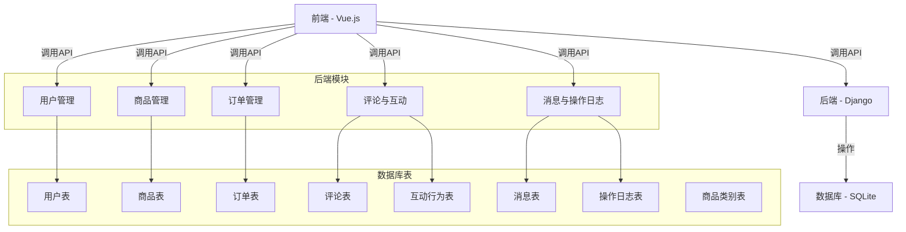
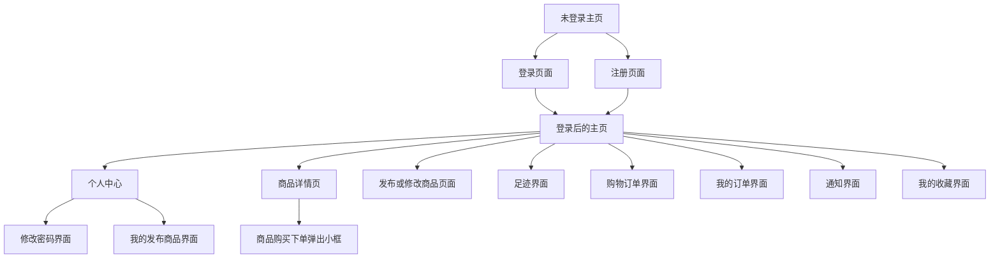
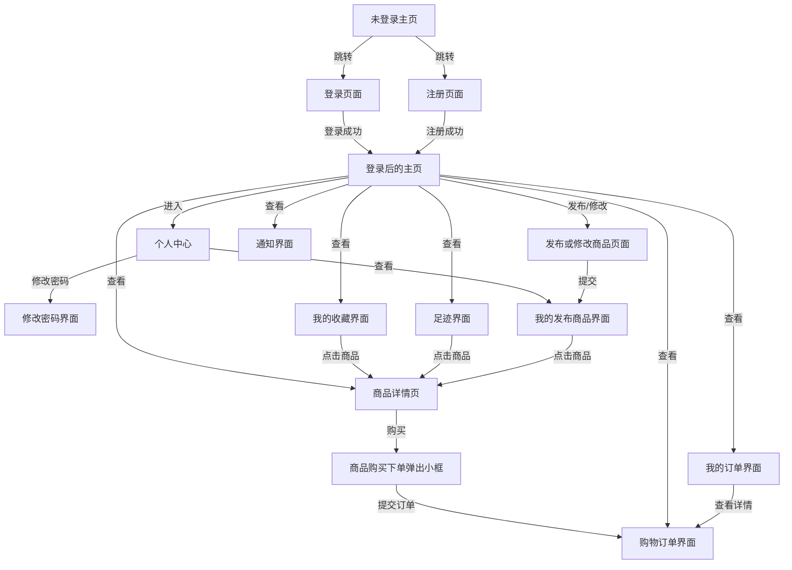

# docs
# 校园二手交易平台

## 📌 项目介绍
校园二手交易平台 是一个基于现代技术栈（Django + Vue.js）开发的二手交易平台，旨在为校园内的师生提供一个便捷、安全、高效的二手商品交易场所。用户可以通过平台发布、浏览和购买二手商品，参与互动交流，同时提供订单管理、评论系统和私信功能，增强用户体验。

## 👥 小组成员及分工

| 姓名 | 学号 | 分工 |
| --- | --- | --- |
| 陈彤 | 2212190102 | 前端开发、页面设计、Axios接口对接、项目文档撰写|
| 徐鹏强 | 2312990114 | 数据库设计、接口开发、后端开发 |
| 张佳欣 | 2212190105 | 测试、汇报PPT制作 、项目文档撰写|

## 🏗️ 项目结构
```plaintext
├──trading/                 # 后端项目主目录
|  ├── settings.py          # 项目设置
|   ├── urls.py              # 主URL配置
|  └── ...
|   accounts/                # 应用目录
|  ├── models.py            # 数据模型
|  ├── serializers.py       # 序列化器
|  ├── views.py             # 视图函数
|  ├── urls.py              # URL路由
|  ├── tests.py             # 测试用例
|  ├── README.md            # API文档
├── frontend/                   # 前端项目（Vue + Axios）
│   ├── src/
│   │   ├── assets/                # 静态资源（图片、字体等）
│   │   ├── components/            # 公共组件
│   │   ├── views/                 # 页面视图
│   │   ├── store/                 # Vuex状态管理
│   │   ├── router/                # 路由配置
│   │   ├── api/                   # Axios请求封装
│   │   └── App.vue                # 根组件
│   ├── public/                   # 公共静态资源
│   ├── package.json              # 前端项目配置文件
└── README.md                    # 项目说明文件
```

## 🏗️ 项目计划

### 阶段 1：需求分析与设计 (2周)
**目标**：
- 确定项目的功能需求、技术栈及开发工具。
- 完成系统架构设计和数据库表设计。
- 撰写项目开发文档，确定每个模块的功能。

**任务**：

- **需求分析**：
  - 通过与小组成员讨论，明确平台核心功能（商品发布、商品浏览、下单、评论互动等）。
  - 设计用户角色（普通用户、管理员等）和对应的权限。

- **数据库设计**：
  - 根据需求设计数据库表（用户、商品、订单、评论、互动行为等表）。
  - 确定表之间的关系，并设计相应的外键约束。

- **项目架构设计**：
  - 规划前后端分离开发模式。
  - 确定接口的设计（RESTful API）。

- **技术调研**：
  - 确定使用的前端技术（Vue 3、pinia、Vue Router、axios）。
  - 确定后端框架（Django）。
  - 数据库（Sqlite）。

**输出**：
- 完成数据库表设计文档。
- 提交项目架构设计图（可以使用Mermaid绘制）。
- 撰写项目的README.md文件，说明项目目标、技术栈、任务分配。

---

### 阶段 2：前端开发 (3周)
**目标**：
- 搭建前端页面结构，完成页面设计与路由配置。
- 实现用户界面的交互功能，并与后端API进行联调。

**任务**：

- **前端框架搭建**：
  - 设置前端开发环境，安装Vue、Vue Router、Vuex等必要依赖。
  - 配置前端路由，设置页面组件（首页、商品详情页、订单页等）。

- **页面设计与实现**：
  - 设计并实现平台的主要页面，如商品列表、商品详情页、登录注册、用户中心等。
  - 使用Element UI或其他UI框架设计交互性较强的页面（如商品发布页、订单页面）。
  - 实现商品搜索、筛选等功能。

- **与后端接口对接**：
  - 使用Axios封装API请求。
  - 实现前端与后端的联调，包括商品发布、订单管理、用户登录注册等模块。

- **前端功能测试**：
  - 测试页面的交互功能，确保用户操作流程顺畅。

**输出**：
- 完成前端页面设计，并提交前端代码。
- 前后端联调完成，并完成基本的功能测试。

---

### 阶段 3：后端开发 (3周)
**目标**：
- 搭建后端服务框架，实现核心功能。
- 完成数据库操作、业务逻辑处理及接口实现。

**任务**：

- **后端框架搭建**：
  - 创建Django项目，配置相关依赖。
  - 设置数据库，确保与SQLite数据库的连接正常。

- **用户管理模块**：
  - 实现用户注册、登录、个人信息修改等功能。
  - 完成用户验证与权限控制（如JWT或Session管理）。

- **商品管理模块**：
  - 完成商品的增、删、改、查（CRUD）功能。
  - 实现商品分类管理、商品上传图片功能。

- **订单管理模块**：
  - 完成订单的创建、查询、支付等功能。

- **评论与互动模块**：
  - 实现商品评论、点赞、收藏等功能。

- **RESTful API设计与实现**：
  - 设计符合RESTful规范的API。
  - 实现商品、订单、用户、评论、互动行为等模块的接口。

**输出**：
- 后端服务搭建完成，所有核心功能模块已实现。
- 后端接口文档编写，并与前端对接测试。

---

### 阶段 4：测试与调试 (2周)
**目标**：
- 完整测试系统功能，进行调试与优化。
- 确保前后端联调成功，修复BUG并提升系统稳定性。

**任务**：

- **功能测试**：
  - 前后端联调后，进行综合测试，确保所有功能正常运行。
  - 测试订单流程、商品发布、评论功能等，确保数据正确流转。

- **性能优化**：
  - 对数据库查询、接口响应时间等进行优化。
  - 处理可能的性能瓶颈（如分页查询、缓存优化）。

- **Bug修复与调试**：
  - 根据测试结果修复前端与后端的bug。
  - 确保系统没有重大的功能漏洞。

**输出**：
- 完成所有功能模块的测试，并修复所有已知BUG。
- 系统性能优化，确保平台的稳定运行。

## 🏗️ 系统架构

## 🏗️ UI设计
**网址**：
- https://modao.cc/proto/design/pb2m8411i62hcms0e

**网站地图**：



**线框图**


